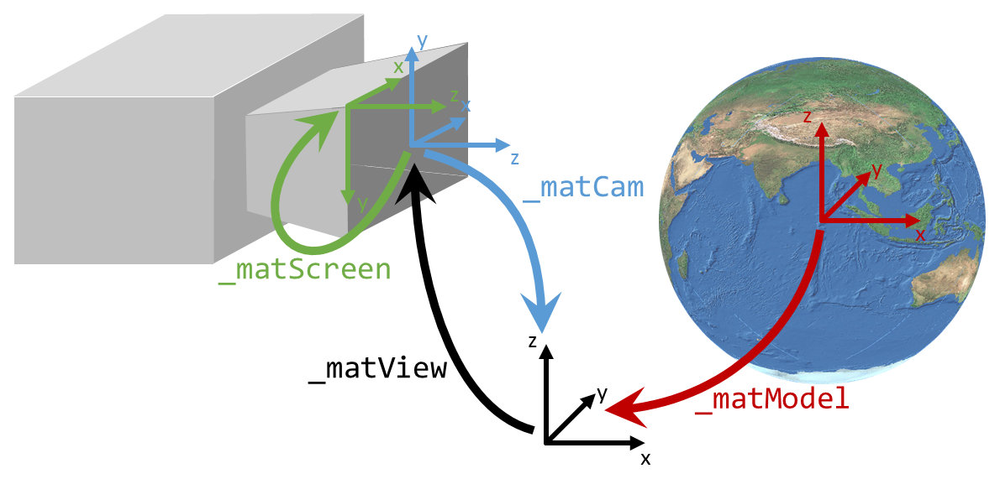
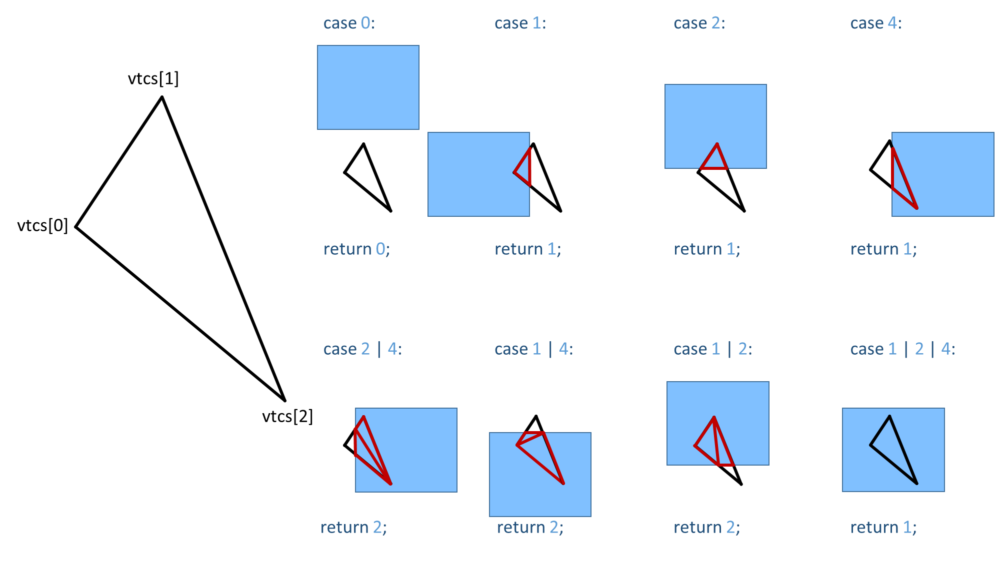

# No-GL 3D Renderer

(If you ask &ldquo;Why?&rdquo; you missed the point.)

This was inspired by a Stack Overflow question [software rasterization implementation speed up ideas](https://stackoverflow.com/a/52534685/7478597). In the answer I provided, I left out any color interpolation to gain the maximum speed. So, I became curious about how much certain options like

- color interpolation
- depth buffering / testing
- texture mapping
- lighting

might cost.

So, I prepared this project.

It appears to be less useful nowadays where nearly every computer (incl. smartphones) seems to have a GPU.
On the other hand, such things (which I still learned and practiced while I was studying at University) are usually under the hood &ndash; at best, somebody can imagine how it may work.

So, I came to the idea that it might be funny to do this again as if there were no GPU &ndash; for my own joy and education and, may be, for somebody else's too who is curious about this.

## Build Application

To build the sources, I prepared a Qt project file. On [cygwin64](http://www.cygwin.org), I built the application with:

    $ qtmake-qt5 qNoGL3dDemo.pro
    
    $ make
    
    $ ./qNoGL3dDemo

There is also a `CMakeLists.txt` file which I used to make a VisualStudio solution. (I debugged and tested in VS2013.) I had to comment the `find_package(Qt5Widgets CONFIG REQUIRED)`. On my side, Qt5 is ready configured by a `CMakeLists.txt` file in the parent directory. It might be necessary to uncomment this line.

I must admit that the version built with cygwin runs fine until I try to make navigation in the 3d widget, and then crashs immediately. I tried to debug it with `gdb` but wasn't even able to get a stack trace. I'm not sure whether this is caused by my application or just something which doesn't work stable in cygwin/Qt.

The debug and release versions, I built with VS2013 run stable on my side without any problems.

## Renderer

The `RenderContext::render()` function has to be called to render the 3d contents into the frame buffer of the `RenderContext`. Actually, this does nothing else than calling the render callback which has to be installed before:

    void render() { _cbRender(*this); }

The render callback may call the various methods to change internal states of the `RenderContext` including one of the most important: `RenderContext::drawVertex()`.

Each call of `RenderContext::drawVertex()` adds a vertex to an internal buffer. It collects vertices until 3 vertices are available to rasterize a triangle. With the 3rd vertex, the internal vertex buffer is processed with `RenderContext::rasterize()` and cleared afterwards.

The triangle vertex coordinates are transformed into view space by multiplying with the MVP matrix.

**MMVP** = **MProjection** &middot; **MView** &middot; **MModel**

**v'** = **MMVP** &middot; (**v**, 1)

The MVP matrix represents the model space &rarr; world space &rarr; view space transformation. I'd like to mention that using 4&times;4 matrices for transformations allows to concatenate transformations by multiplying their matrices. Finally, they can be applied to every vertex at once &ndash; a trick which is very common in 3d computer graphics.

The vertex coordinates which are 3d coordinates are converted to [homogeneous coordinates](https://en.wikipedia.org/wiki/Homogeneous_coordinates#Use_in_computer_graphics_and_computer_vision) using them as 4d coordinates with 4th component w = 1. (Otherwise, multiplication with 4&times;4 matrix would not be possible.) After transformation, the 4d vector is converted back to a 3d vector.

After clipping away parts of the triangle which are outside of view space, the left triangle vertices are transformed into screen space.

**v"** = **MScreen &middot **v'**

These transformations are similar to OpenGL. Song Ho Ahn published a nice introduction into this topic: [OpenGL Transformation](http://www.songho.ca/opengl/gl_transform.html).

### Lighting

This is the most simple kind of lighting which is imaginable:

- only global light (with infinite distance of light source) supported
- lighting calculations per vertex normals only.

Thus, the result of lighting is applied to vertex colors.

The colors of rasterized vertices are simply interpolated.
This is called [Gouraud-Shading](https://en.wikipedia.org/wiki/Gouraud_shading) &ndash;
the most simple (and most ugly) form of lighting calculation I know but also the one with the least performance impact.

Thereby, the angle of vertex normal to light vector is evaluated.

cos(&alpha;) = (normal &middot; light) / (|normal| &middot; |light|)

Assuming that `normal` as well as `light` should be normalized, this simplifies to

cos(&alpha;) = (normal &middot; light)

The nice fact about this is that it's not necessary to call the &ldquo;expensive&rdquo; `acos()` in this calculation.
For my purpose, the cos(&alpha;) value is fully sufficient. It is:

- 1 if `normal` and `light` are identical (i.e. sun shines upright onto face)
- between 0 and 1 for angle of `normal` and `light` &lt; 90&deg;.
- 0 if `normal` and `light` are orthogonal (i.e. sun shines along face)
- &lt; 0 for angle of `normal` and `light` &gt; 90&deg;.

Angles &gt; 90&deg; are irrelvant &ndash; a face in the shadow is simply dark.

Hence, the result of (normal &middot; light) is simply multiplied with the color value.

The fixed-pipe OpenGL engine supports additional lighting effects like:

- specular lighting
- point lights.

For now, I ignored this.
I got the impression that the absence of these things hides quite good the weakness of Gouraud shading.

### Clipping

The clipping is applied to vertices to exclude parts of the triangle which are not inside the view frustum.

The view space has the range [-1, 1] for x, y, and z direction. It can be described by six clip planes.

Hence, the given triangle is clipped against all six clip planes in a loop. Thereby, the clipping may keep the original triangle, cut the triangle, or eliminate the triangle completely. In second case, the result of cutting might be a triangle or a quadrilateral. Quadrilaterals are split into two triangles.

Hence, the clipping of a triangle may yield 0, 1, or 2 new triangles. As there are six clip planes, each clipping may duplicate the number of triangles. Finally, there might be 26 = 64 triangles.

(I'm not sure whether the number of possible triangle isn't even lower. After thinking a while without success, I leave it as is. 64 is not that high and will appear at best in very special cases only.)

## Rasterizer

When the rasterizer is called, vertex coordinates are already transformed into screen space.

### Interpolation of Coordinates

This means

- x coordinate of a visible pixel must be in the range \[0, width)
- y coordinate of a visible pixel must be in the range \[0, height)
- z coordinate might be considered for depth buffering / depth test.

The `RenderContext::rasterize()` function has to fill horizontal screen lines. For this, I sort the 3 triangle vertices by their y components. In regular case, this allows to cut the triangle horizontally into two parts:

- the upper with peak above of horizontal base
- the lower with peak below of horizontal base.

The horizontal base is delimited on one end by the middle vertex, on the other end by the horizontally projected point on the line from top to bottom vertex. For this constructed vertex, the color and texture coordinates are interpolated according to the ratio (yM - yT) / (yB - yM).

Border cases like

- yT = yM
- yM = yB or even
- yT = yM = yB

are simply covered by tests which may skip the upper, lower, or even both parts.

### Shading

As the lighting calculations are applied to the vertex colors, there is no distinction between

- color interpolation (interpolating pixel colors according to the distance of this pixel to the vertices and their associated colors)
- shading (modification of vertex colors according to lighting).

If smooth rendering is enabled (`RenderContext::Smooth`) pixel colors are interpolated for each pixel (x, y).

If lighting is enabled additionally (`RenderContext::Lighting`) vertex colors are pre-modified according to angle of corresponding vertex normals and light vector. (This is done prior to rasterizing.)

Lighting enabled while smooth rendering disabled results in flat shading. (This makes the demo sphere similar looking like a golf ball.)

In modern OpenGL (with GLSL), lighting can be done per pixel. This allows there natural looking effects.
In my case, it would require expensive calculations in the most inner loops of `RenderContext::rasterize()`.
If I understood it right, this was the actual intention of the OP in [software rasterization implementation speed up ideas](https://stackoverflow.com/a/52534685/7478597) where he complained about the miserable frame rate. I believe a per-pixel lighting is simply too heavy for a software renderer (at least if a multi frame-per-second rate is intended).

### Texturing

OpenGL provides various texture filtering options whereby two situations are distinguished:

- a texel covers multiple pixels
- a pixel covers multiple texels.

Respectively, OpenGL supports

- magnification filters and
- minification filters.

For best performance, I didn't implement any texture filtering. Thus, in both situations the nearest texel is chosen.
This means the U-V coordinates (associated to vertices) are simply interpolated.

The interpolated U-V coordinates are used with my overloaded `Texture::operator[]`.
It subtracts the integer part from the floating point value yielding the decimals (effectively a value in range [0, 1]).
This value is multiplied with the width (u) or height (v), casted to `unsigned int` and provides thus the indices to access the texture image.

## Optimization Attempts

While developing and testing, it became very obvious to me that optimization pays off best in the most inner loops of the `RenderContext::rasterize()` (i.e. the two iterations over x).
(Unfortunately, I cannot remember the title of the book where I read this nor the author but I memorized it as a good rule of thumb: &ldquo;If you try to optimize then optimize the most inner loops and leave any other loop as is.&rdquo;)
Therefore, I intended to remove branches from this most inner loops as most as possible.
According to the different rendering modes, there are still certain options which might be enabled or disabled.
Therefore, I made all these options as template parameters of `rasterize()`.
Hence, when `rasterize()` is compiled all these conditions check constant values, and a modern compiler should simply remove the `if()` check where the body is compiled in or left out depending on condition.
So, I need a &ldquo;flavor of&rdquo; `RenderContext::rasterize()` for every possible combination of template arguments.
This is found in `RenderContext::drawVertex()` where I made an array `rasterizes[]` initialized with template function instances iterated through every combination of possible template argument values.
Afterwards, `RenderContext::drawVertex()` computes the table index `i` combining all relevant modes accordingly.
Thus, the conditions which appear inside of `RenderContext::rasterize()` are actually resolved outside.

<!-- @todo mention Bresenham? -->

<!-- @todo ## Some Measured Values -->

